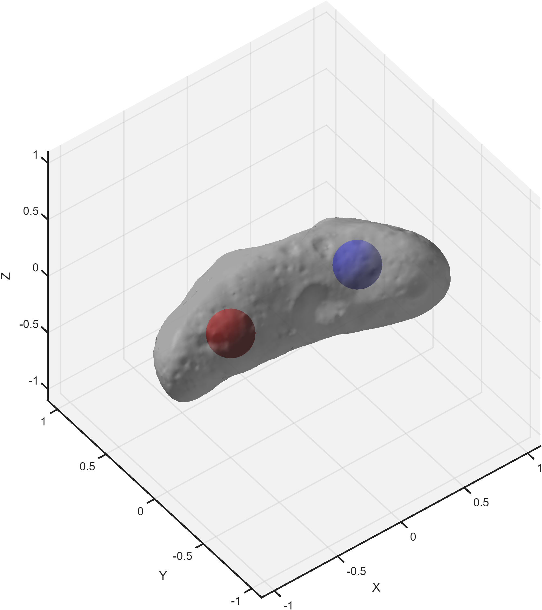

# Gravity Model using PINNs
This Master's Thesis project is about the application of Physics-Informed Neural Networks (PINNs) to the gravity model problem for celestial bodies.

## Overview
Read the [code overview](src/README.md) for implementation details.  
This project focuses on modeling the gravitational field of the asteroid **433 Eros** through a modified [PINN-GM-III architecture](https://arxiv.org/pdf/2312.10257).

### Dataset
Ground truth values are generated using the [GravNN](https://github.com/MartinAstro/GravNN) library, with a [custom script](src/data/GravNN/Scripts/Data/custom.py).  
Such operation generates `(x,a,u)` values using a heterogeneous-density polyhedral gravity model, computed as the superimposition of a typical constant-density polyhedral model and 2 point-mass models (+/- mass) displaced on the x-axis.  


### Architecture
This project implements [PINN-GM-III](https://arxiv.org/pdf/2312.10257) in MATLAB and performs several tweaks to the architecture:
1. Changing training bounds transition function from *tanh* to *smoothstep* for limited transition range
2. Learning layers tested modifications:
   - Autoencoder
   - Factorized layers
   - Fourier Neural Operator
   - Simple MLP
   - Residual network
3. Sine activations
4. Learnable RBF features
5. Learnable FiLM + Gating of the features
6. Tweaking power of the *learned potential* vs *analytic potential* inside the network
7. Radius-based weighting of the loss during training to focus specific altitudes

## Instructions
1. MATLAB R2025a + `Deep Learning Toolbox` and `Parallel Computing Toolbox`
2. Python `trimesh` and `numpy` (only if running with [`DO_DATA_EXTRACTION=true`](src/main.m#L15))

Run the [main script](src/main.m) from the root folder in GUI mode.  
Alternatively run with SLURM in batch mode as:
```
cd path/to/PINN-GravityModel
srun matlab -batch "run('src/main.m')"
```

## Authors
[Andrea Valentinuzzi](https://github.com/akappakappa), [Giovanni Brejc](https://github.com/Govawi)  
Computer Engineering at University of Padua, Italy

Supervised by Prof. Loris Nanni, Department of Information Engineering at University of Padua, Italy